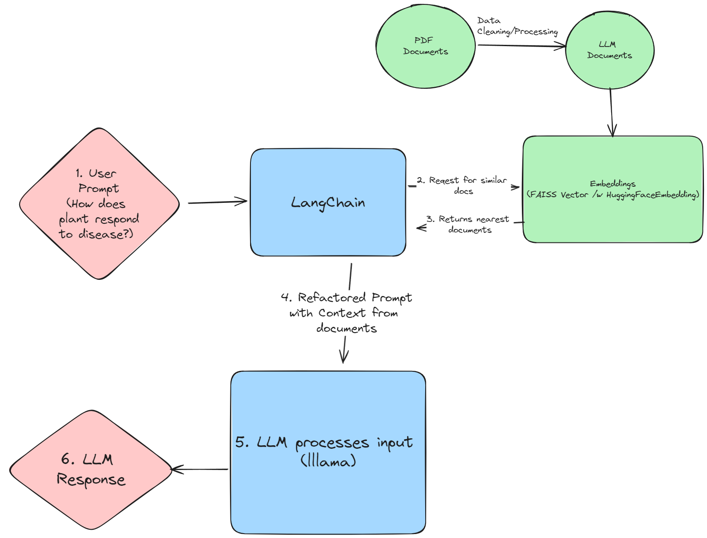

# llama /w RAG test

Following https://medium.com/@imabhi1216/implementing-rag-using-langchain-and-ollama-93bdf4a9027c as a guide try to get a LLM running locally with RAG.

## Reproducable steps


1. Create a dedicated python environment (optional/recommended: if you want to keep packages separate)
2. ./install-requirements.sh
3. python test.py

NOTE: This was tested in a wsl2 ubuntu 22.04 environment with an NVIDIA GPU

## Desired Output


```
1. Use the following pieces of context to answer the question at the end.
2. If you don't know the answer, just say that "I don't know" but don't make up an answer on your own.

3. Keep the answer crisp and limited to 3,4 sentences.

Context: Context:
content:Kentucky Pesticide Education Program
copyright © 2016 University of Kentucky Department of Entomology
Agricultural Plant Diseases
Plant Diseases
A plant disease is any harmful condition that affects a plant’s appearance or function. Common pathogens that cause diseases include: fungi,
bacteria, and viruses. Some nematodes are plant disease agents. Temperature extremes or nutrient deficiencies are examples of disorders caused by
non-infectious factors. The disease triangle is a fundamental concept in plant pathology. Disease occurs only when all three sides of the triangle are present: a susceptible
host, apathogen (the agent that causes disease), and an environment favorable for disease to develop. Plant diseases are managed by manipulating
the disease triangle: the plant, the pathogen, and/or the environment. Infection begins when the pathogen enters the plant. The disease process starts when it arrives at a part of a plant where infection can occur. If
environmental conditions are favorable, the pathogen begins to develop. The plant is diseased when it responds. Plants respond to disease in 3 main ways:
1. overdevelopment of tissue - galls, swellings, or leaf curls;
2.
source:11pests1disease.pdf

Context:
content:underdevelopment of tissue - stunting, lack of chlorophyll, or incomplete development of organs; or
3. tissue death - blight, leaf spot, wilting, and cankers. Plant disease pathogens may be spread in many ways:
 by wind;
 rain;
 animals;
 soil;
 nursery grafts;
 vegetative propagation;
 contaminated equipment and tools;
 infected seed stock;
 pollen;
 dust storms;
 irrigation water; and
 people. 
source:11pests1disease.pdf

Context:
content: Reproduction occurs on resistant soybeans.  Moves every way that soil moves.  SCN can be present in a field for many years before it is detected.  Symptoms may look like those due to other causes. Diagnosis of Plant Diseases
A correct diagnosis is the first step in disease management. To recognize a disease condition, you must know the plant's normal growth habits. When
you are trying to identify the cause of a plant disease, you need to look for symptoms - the host plant's reaction to the disease agent, and signs - visible
presence of the disease agent. Many different plant diseases cause similar symptoms. Different pathogens and agents that are not pathogens can cause leaf spots, wilts, root galls,
or stunted growth. For example, similar symptoms may be a result of mechanical injury, improperly applied fertilizers and pesticides, or frost. Often,
the only way to pinpoint the cause is to find the observable signs that the particular disease agent is present -such as fungal spores and mycelium or
bacterial ooze. 
source:11pests1disease.pdf

Question: How does plant respond to disease?

Helpful Answer:

> Finished chain.

> Finished chain.
A plant responds to disease in three main ways:

1. Overdevelopment of tissue - galls, swellings, or leaf curls.
2. Underdevelopment of tissue - stunting, lack of chlorophyll, or incomplete development of organs.
3. Tissue death - blight, leaf spot, wilting, and cankers.
```

## Architecture Diagram



## FUN NEXT STEPS

- Do this in an automated way for multiple PDFs
- Save vectordb for reuse
- Make this runnable as a server
